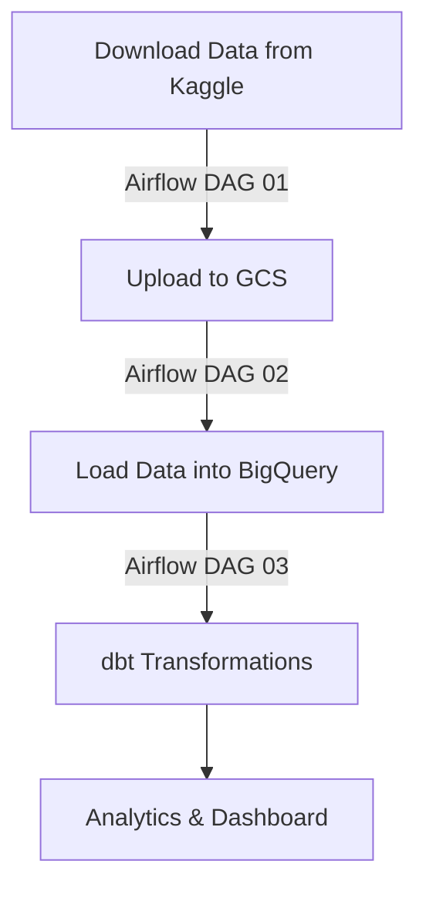

# World Happiness Index & Inflation Analysis - End-to-End Data Pipeline

## Project Overview
This project is built for **Google Cloud Platform (GCP)** and aims to develop an end-to-end data pipeline leveraging the [**World Happiness Index and Inflation Dataset**](https://www.kaggle.com/datasets/agrafintech/world-happiness-index-and-inflation-dataset) from Kaggle. The dataset provides a comprehensive view of global happiness trends, GDP per capita, social factors, and inflation metrics from **2015 to 2023**.

### Problem Statement
Understanding the relationship between **happiness levels, GDP, and inflation** is crucial for policymakers, economists, and researchers. This project processes and analyzes the dataset to:
- Identify trends in happiness scores across continents and countries.
- Measure the impact of inflation on happiness.
- Compare GDP growth with happiness levels.
- Provide insights using **dbt models and dashboards**.

## Project Startup

### Prerequisites

- Google Cloud Platform account
- Terraform

### GCP Configuration
 - Open Google Cloud Platform (GCP) Console
 - Create a Google Cloud Platform (GCP) project (e.g., `Data Camp 2025`).
 - Set up a **service account** named `service` and assign the following roles: **Editor, Security Admin, Service Account Admin**.
 - Save the service account key file as `01-terraform/credentials/gcp_key.json`.

### Terraform Setup

Terraform automates the infrastructure deployment on GCP.

- Copy `01-terraform/terraform.tfvars.example` file as `01-terraform/terraform.tfvars` and adjust the variables as needed.
    ```hcl
    project_id          = "data-camp-capstone-2025"
    region              = "europe-west3"
    gcs_bucket_name     = "happiness-data-lake-bucket"
    bq_dataset_name     = "happiness_analysis"
    composer_env_name   = "happiness-airflow"
    ```
- Run the following commands to initialize and deploy the infrastructure:
   ```sh
   cd 01-terraform
   terraform init
   terraform apply -auto-approve
   ```
- After deployment, the **Airflow Web UI URL** will be displayed in the Terraform output.

    ```sh
    bq_dataset_id = "happiness_analysis"
    composer_airflow_uri = "https://76e1ce12e60c4666929ae6d1ea944cf8-dot-europe-west3.composer.googleusercontent.com"
    gcs_bucket_url = "gs://happiness-data-lake-bucket"
    ```

### Manual Execution of DAGs

Once Terraform completes the setup, access the **Airflow Web UI** (URL provided in Terraform output). The DAGs must be triggered manually in the correct order:
1. Run `01-ingest_to_datalake.py` to download dataset from Kaggle and upload it to **Google Cloud Storage (GCS)**.
2. Run `02-copy_to_dwh.py` after the first DAG completes to transfers data from GCS to **BigQuery**.
3. Run `03-transform_dbt.py` after the second DAG completes to run **dbt transformations** to clean, process, and analyze data.

After jobs are finished the following tables will be created in **BigQuery** dataset:
- `happiness_index_inflation`: Computes **average inflation** and **real GDP per capita**.
- `continent_annual_trends`: Aggregates happiness trends by continent.
- `country_yoy_changes`: Year-over-year happiness & inflation changes.
- `happiness_inflation_analysis`: Calculates **happiness per inflation & happiness per GDP ratios**.
- `multi_year_averages`: Multi-year trend analysis.

## Project Structure

### Project's directory structure

```
project-root/
│
├── 01-terraform/               # Infrastructure as Code
├── 02-workflow-orchestration/  # Apache Airflow DAGs
├── 03-analytics-engineering/   # dbt models
└── README.md
```

### Tech Stack Summary


- **Cloud Provider:** Google Cloud Platform (GCP)
- **Infrastructure as Code:** Terraform
- **Workflow Orchestration:** Apache Airflow (Cloud Composer)
- **Data Storage:** Google Cloud Storage (GCS)
- **Data Warehouse:** BigQuery
- **Data Transformation:** dbt (Data Build Tool)
- **Dashboarding & Visualization:** Looker Studio

### Terraform Scripts

The Terraform scripts located in `01-terraform/` perform the following tasks:
- Activate necessary GCP APIs.
- Configure IAM roles and permissions.
- Create a **Cloud Storage bucket** for the Data Lake.
- Create a **BigQuery dataset** for analytical queries.
- Set up a **Cloud Composer** environment for **Apache Airflow**.
- Upload DAG files from `02-workflow-orchestration/` to the **Airflow bucket**.
- Upload the **dbt project** from `03-analytics-engineering/happiness_analytics/` to the **Airflow bucket**.

### Workflow Orchestration (Apache Airflow)

Located in `02-workflow-orchestration/`, the DAGs execute the data pipeline:
- **`01-ingest_to_datalake.py`**: Downloads dataset from Kaggle and uploads it to **Google Cloud Storage (GCS)**.
- **`02-copy_to_dwh.py`**: Transfers data from GCS to **BigQuery** with clustering (`Year`, `Country`, `Continent_Region`).
- **`03-transform_dbt.py`**: Triggers **dbt transformations** to clean, process, and analyze data.

### Clustering Strategy in BigQuery

Clustering the data in BigQuery improves query performance and reduces costs. The dataset is clustered on **Year, Country, and Continent_Region**, which makes sense because:
- **Year**: Optimizes time-based queries (e.g., trends over time).
- **Country**: Enhances queries that analyze happiness and inflation by country.
- **Continent_Region**: Allows efficient continent-wide aggregations.
This clustering strategy ensures that **queries retrieving specific years, countries, or continents are significantly faster and more cost-effective**.

### Analytics Engineering (dbt Transformations)

Located in `03-analytics-engineering/happiness_analytics/`, the **dbt models** perform key transformations:
- **stg_happiness.sql**: Staging table for raw data.
- **happiness_index_inflation**: Computes **average inflation** and **real GDP per capita**.
- **continent_annual_trends**: Aggregates happiness trends by continent.
- **country_yoy_changes**: Year-over-year happiness & inflation changes.
- **happiness_inflation_analysis**: Calculates **happiness per inflation & happiness per GDP ratios**.
- **multi_year_averages**: Multi-year trend analysis.

## Data Pipeline Architecture



## Key Features & Functions

- **Automated Data Pipeline:** Handles **data ingestion, transformation, and loading**.
- **Optimized Storage & Querying:** Uses **BigQuery clustering** for efficient queries.
- **dbt for Analytics Engineering:** Modular and scalable data transformations.
- **Dashboard Integration:** Final insights presented in a **BI dashboard**.

## Dashboard Preview
*Insert a screenshot of your BI dashboard here.*

## License
This project is licensed under the MIT License.

## Acknowledgments
- [**Data Engineering Zoomcamp Course**](https://github.com/DataTalksClub/data-engineering-zoomcamp)
- [**DataTalks.Club**](https://datatalks.club/)
- [Kaggle for the World Happiness Index dataset](https://www.kaggle.com/datasets/agrafintech/world-happiness-index-and-inflation-dataset)
- Google Cloud Platform
- Apache Airflow Community
- dbt Labs
